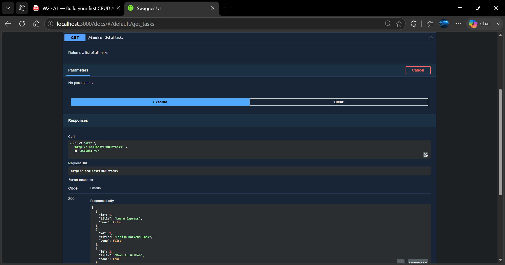

# Task API

A simple REST API built with **Node.js** and **Express.js** that implements full CRUD (Create, Read, Update and Delete) operations for tasks.

---

## Features

- Create tasks
- Read all tasks
- Read a single task
- Update tasks
- Delete tasks
- Swagger UI documentation

---

## Technologies

- Node.js
- Express.js
- Swagger UI Express
- OpenAPI 3.0

---

## Installation

Clone the repository:

```bash
git clone <your-repository-url>
```

Go into the project folder:

```bash
cd task-1-CRUD
```

Install dependencies:

```bash
npm install
```

Start the server:

```bash
node server.js
```

The API will be available at:

```
http://localhost:3000
```

Swagger UI:

```
http://localhost:3000/docs
```

---

## API Endpoints

| Method | Endpoint | Description |
|---------|----------|-------------|
| GET | `/` | API information |
| GET | `/health` | Health check |
| GET | `/tasks` | Get all tasks |
| GET | `/tasks/:id` | Get one task |
| POST | `/tasks` | Create a task |
| PUT | `/tasks/:id` | Update a task |
| DELETE | `/tasks/:id` | Delete a task |

---

## Example curl Request

```bash
curl.exe -i http://localhost:3000/tasks
```

Output:

```http
HTTP/1.1 200 OK
X-Powered-By: Express
Content-Type: application/json; charset=utf-8
Content-Length: 145
ETag: W/"91-ARvCKG/xPsxLBX06dwPkiudn4Nc"
Date: Thu, 16 Jul 2026 20:12:43 GMT
Connection: keep-alive
Keep-Alive: timeout=5

[{"id":1,"title":"Learn Express","done":false},{"id":2,"title":"Finish Backend Task","done":false},{"id":3,"title":"Push to GitHub","done":true}]
```

---

## Swagger UI

Interactive API documentation is available at:

```
http://localhost:3000/docs
```

### Screenshot



---

## Author

**Mamoor Ali Zarrar**